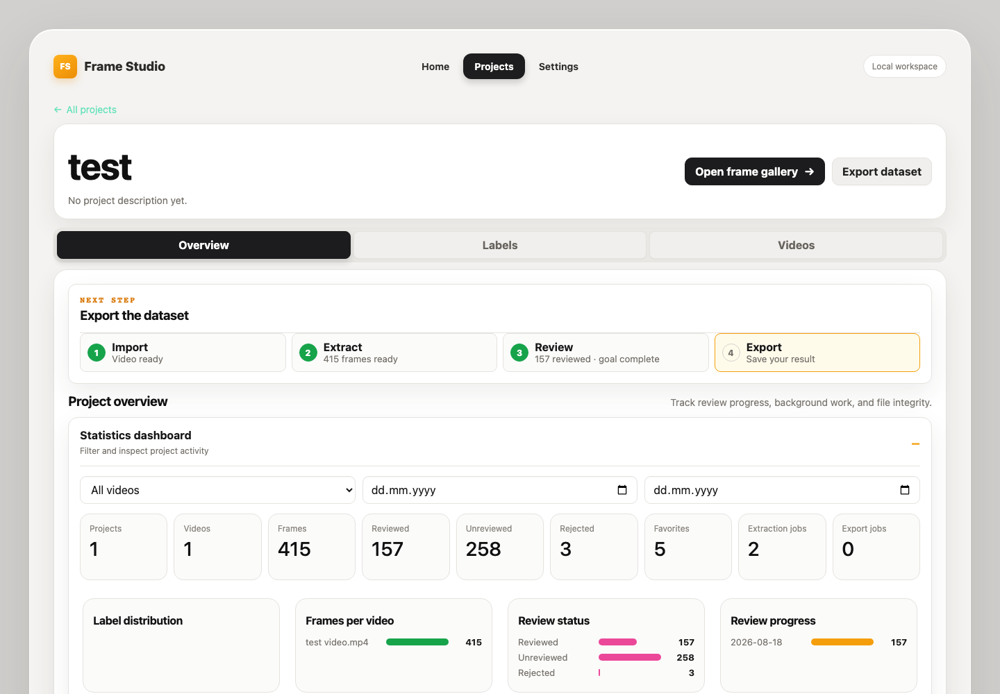

Frame Studio
============

Frame Studio turns local videos into reviewed, labeled, exportable computer-
vision frame datasets. Videos and generated frames stay on your machine; the
responsive browser interface guides you from import through export.

What you can do
---------------

* Import MP4, AVI, MOV, MKV, and WebM videos.
* Extract JPEG or PNG frames by interval, frame rate, or elapsed time.
* Review frames with a focused viewer and configurable keyboard shortcuts.
* Label, favorite, reject, filter, queue, and batch-update frames.
* Track progress, background jobs, and file integrity from one dashboard.
* Export selected or filtered datasets with a machine-readable manifest.

For the fastest installation, start with :doc:`download-and-docker`. Developers
can use :doc:`getting-started`, then follow the illustrated
:doc:`user-guide`. The :doc:`features` page explains the complete workspace.

.. toctree::
   :maxdepth: 2
   :caption: User guide

   getting-started
   download-and-docker
   user-guide
   features
   shortcuts
   troubleshooting

.. toctree::
   :maxdepth: 1
   :caption: Project records

   phase-1-verification
   phase-2-verification
   phase-2-feedback
