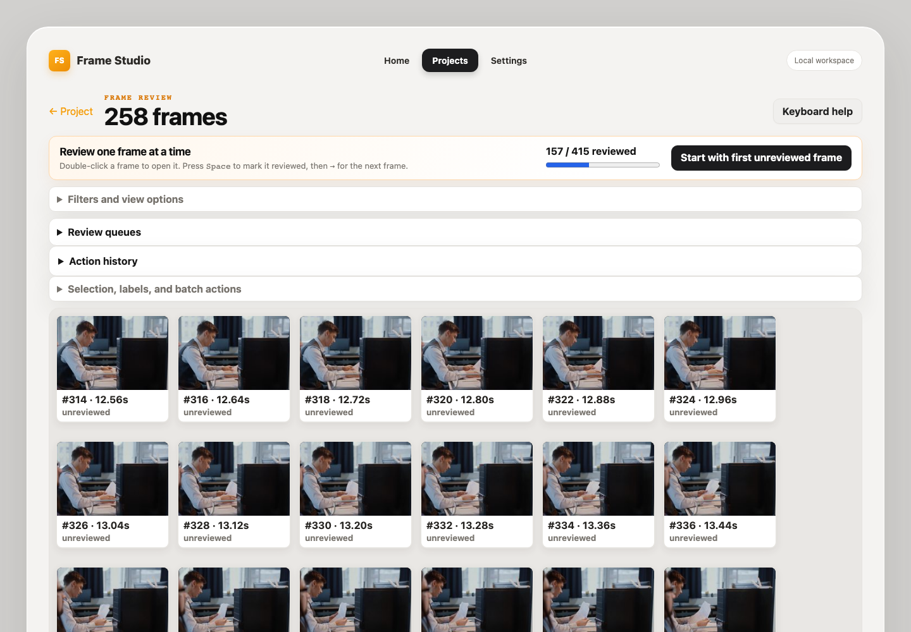
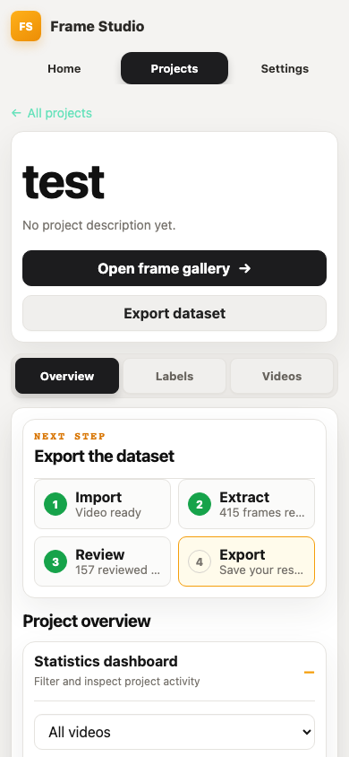

Using Frame Studio
==================

The dashboard presents the workflow in order: **Import**, **Extract**,
**Review**, and **Export**. The highlighted step is the next action to take.

.. image:: _static/images/dashboard-overview.png
   :alt: Desktop Frame Studio dashboard
   :width: 100%

1. Create a project
-------------------

Open **Projects**, select **New project**, and enter a descriptive name. A
project keeps its videos, labels, frames, queues, history, and exports together.
The last project and recently opened projects are available from Home.

2. Import videos
----------------

Open the project's **Videos** tab. Choose individual files or a folder, then
select **Import videos**. Imported files are copied into managed project
storage; the originals are not modified. Unsupported or corrupt files are
reported individually without stopping the rest of a batch.

3. Extract frames
-----------------

Select **Extract frames** beside a video and choose a sampling mode:

* every N source frames;
* a target number of frames per second; or
* every N seconds.

Choose JPEG or PNG and, if necessary, set resize limits. Extraction runs as a
background job with progress and cancellation. You may leave the tab while it
runs.

4. Review frames
----------------

Select **Open frame gallery** and then **Start with first unreviewed frame**.
Double-clicking any thumbnail also opens the focused viewer.

Press :kbd:`Space` to mark the current frame reviewed and :kbd:`Right Arrow`
to continue. Use :kbd:`F` for favorite, :kbd:`R` for rejected, and a label's
assigned key to apply it. Changes are saved immediately.

Use **Filters and view options** to narrow the gallery by video, filename,
review status, labels, favorites, rejected state, unlabeled state, or timestamp.
The gallery automatically changes its column count to fit desktop, tablet, and
phone screens without horizontal page scrolling.

5. Organize with labels and queues
----------------------------------

Create labels in the project's **Labels** tab before reviewing, or create them
from the gallery's advanced controls. Each label can have a color and a unique
one- or two-character shortcut. Click, Ctrl/Cmd-click, or Shift-click to select
frames before applying batch actions.

Review queues preserve an ordered set of frames and the current position. Build
queues from unreviewed, labeled, favorite, rejected, random, or currently
filtered frames, then resume them later.

6. Export a dataset
-------------------

Select **Export dataset** from the project or gallery. Choose selected,
reviewed, favorite, labeled, or currently filtered frames. You can export image
files, a manifest only, or both. Duplicate handling and multi-label folder
behavior are configurable. Export jobs appear in background job history.

Mobile use
----------

On smaller screens, navigation, workflow steps, statistics, forms, and video
actions reflow into touch-friendly columns. Vertical scrolling is expected for
long dashboards, but the document and gallery do not require horizontal
scrolling.
